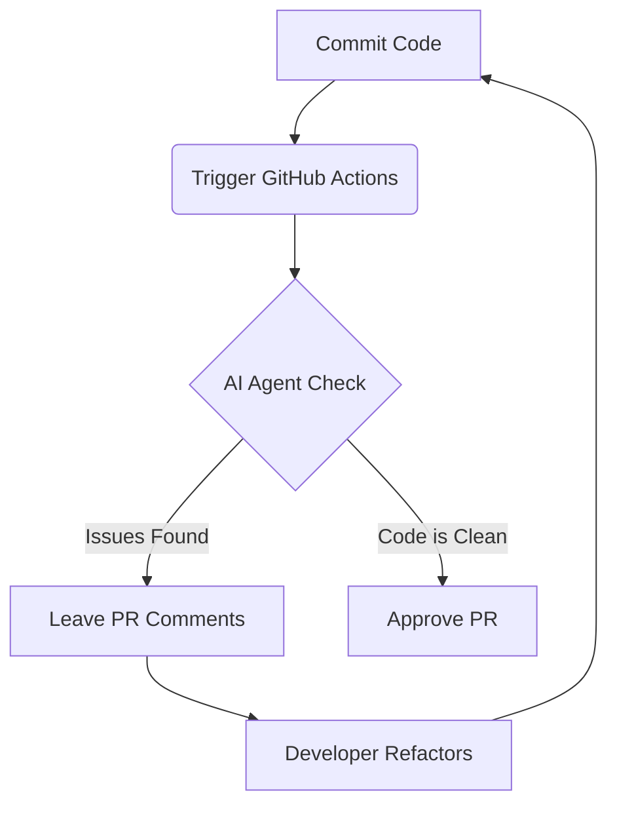

Artificial Intelligence has shifted from a novelty to the core operating system of modern developers. In 2026, the developer's workbench looks vastly different. Let's look at the premier AI tools that are shaping the software landscape.

## The Top AI Code Assistants compared

Here is a quick overview of the most popular AI development tools this year:

| Tool | Primary Use Case | Speed | Customization | Cost |
| :--- | :--- | :--- | :--- | :--- |
| **Cursor** | IDE-wide Autocomplete | Extremely Fast | High | $20/mo |
| **Antigravity CLI** | Terminal Pair Programming | Fast | Extreme | Free / Pro |
| **GitHub Copilot** | Inline suggestions | Fast | Low | $10/mo |
| **Gemini Code Assist** | Enterprise Monorepos | Very Fast | High | Enterprise |

> [!IMPORTANT]
> Always review enterprise terms before inputting production credentials or source code into any AI system.

## Setup a Modern Script for AI Automation

Here is a quick script demonstrating how to interface with a local agent API to build automated code reviews:

```javascript
// agent-review.js
import { AgentClient } from 'antigravity-ai-sdk';

const client = new AgentClient({ apiKey: process.env.AG_API_KEY });

async function reviewPullRequest(prId) {
  console.log(`Starting review for PR: ${prId}`);
  const review = await client.analyze({
    pr: prId,
    focus: 'performance, security'
  });
  
  console.log('Review Summary:', review.summary);
  return review.issues;
}

reviewPullRequest(42);
```

## Mermaid Workflow Diagram

Here is how code moves through an automated AI review pipeline:



## Conclusion

Automating your development pipeline with AI is no longer optional. The tools discussed above offer incredible productivity gains. Explore them and decide which fits your team's workflow best.
